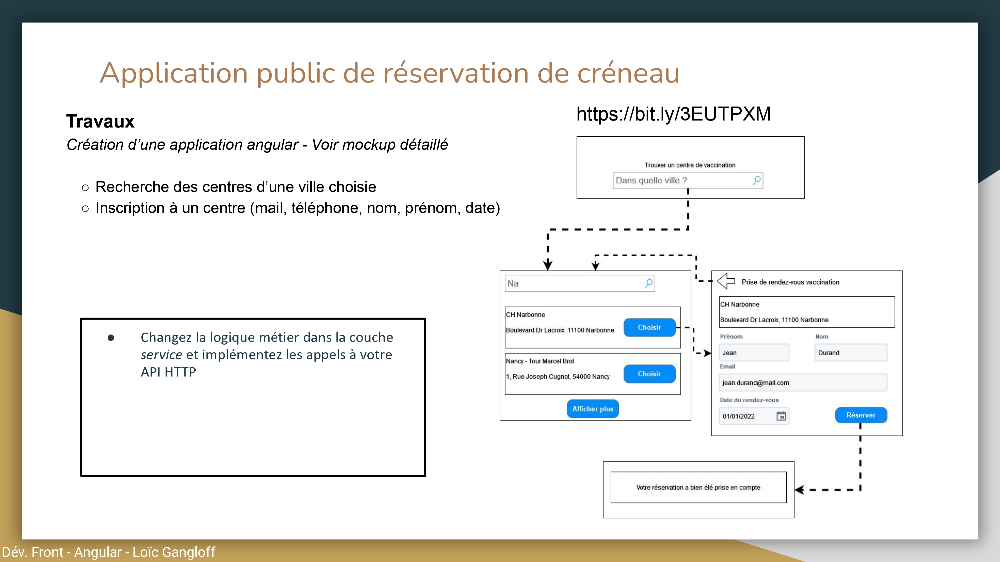
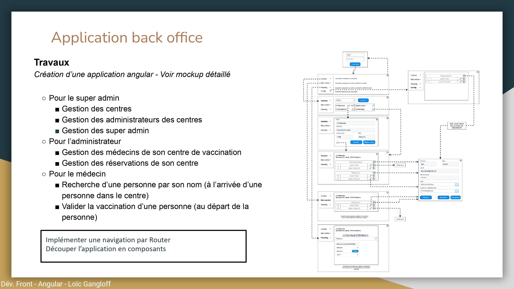

# Gaplaut2 

Gaplaut2 is a web application for managing a fleet of medical centers. Its backend is developed with Java Spring Boot and a PostgreSQL database. The frontend is developed with Angular.

## Database schema

Here is the database schema of the application based on the instructions given in the subject. (see images below)
    

#### Center
    - ID
    - Name
    - Address
    - ZipCode
    - City

#### User
    - ID
    - Role
    - Lastname
    - Firstname
    - Email
    - Password
    - CenterID

#### Booking
    - ID
    - Lastname
    - Firstname
    - Email
    - Date
    - IsVaccinated

## Instructions of the assignment

### Public application for booking appointments
</img>

### Back office application for managing the fleet of medical centers
</img>
